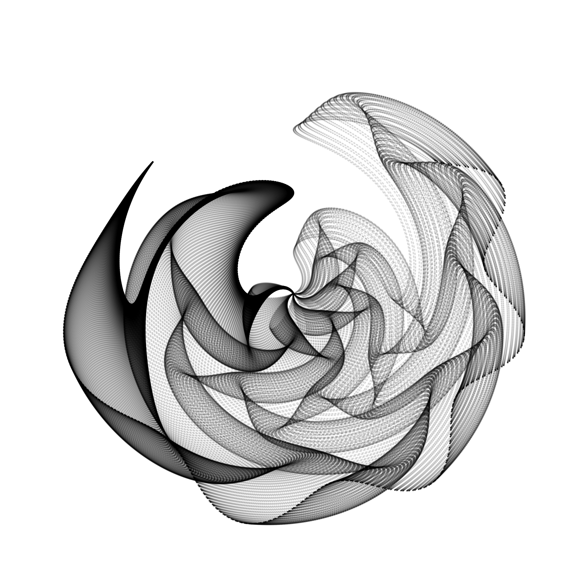

A repository for sharing my various projects and code
-----------------------------------------------------

In this repository you will find the following folders:

1.  `ROC_animations` contains animations with receiver operating
    characteristic (ROC) and precision-recall curves like the one below.
    This folder also contains scripts to generate these animations.
    
2.  `generativeart` contains images and animations I made using
    `generativeart` package in R.
    
3.  `tree_animation` contains animations for my thesis work. There is
    one script to make an animation that shows a protein sequence
    evolving along a phylogenetic tree.
